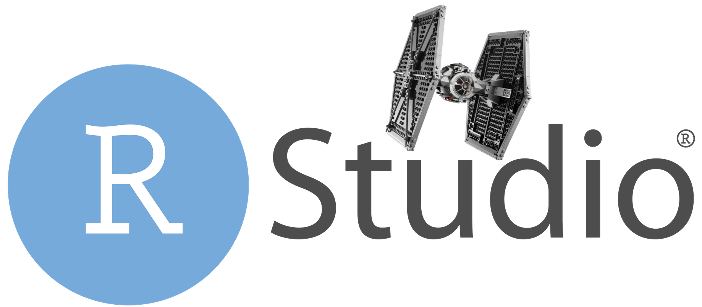

# RStudio Connect and Tidyverse Roadshow

These demos are designed to highlight the [tidyverse](http://tidyverse.org) and [RStudio Connect](https://rstudio.com/about/products/connect). We obtain data from the [Star Wars API](http://swapi.co/about) and the [quantmod](https://www.quantmod.com/) package to produce output using [R Markdown](http://rmarkdown.rstudio.com), [Shiny](http://shiny.rstudio.com), and [Plumber](https://www.rplumber.io/).

### Star Wars Demos

1. [Quick facts reports](http://colorado.rstudio.com:3939/content/624/rmd_unparam.html). Create a descriptive report for a single Star Wars character.

2. [Quick facts report with user inputs](http://colorado.rstudio.com:3939/content/807/rmd_param.html) [[Login]](https://colorado.rstudio.com/rsc/connect/#/apps/807/access/822). Create a descriptive report for any Star Wars character based on user input.

3. [Speed dashboard](http://colorado.rstudio.com:3939/content/1811/). Analyze ship speed as a function of various inputs. 

### Star Wars Notebooks

1. [Tidyverse notebook](http://colorado.rstudio.com:3939/content/1818/tidyverse_notebook.nb.html). Use the tidyverse to access, understand, and communicate insights about the star wars data.

2. [Hyperdrive notebook](http://colorado.rstudio.com:3939/content/1800/hyperdrive_notebook.nb.html). Use the tidyverse to model and predict the the future of hyperdrive in the Star Wars galaxy.

3. [Ships notebook](http://colorado.rstudio.com:3939/content/1808/notebook.nb.html). Visualize information about star wars ships.

### Examples from our galaxy

1. [Stock report](http://colorado.rstudio.com:3939/content/621/rmd_parameterized_stockreport.html) [[Login]](https://colorado.rstudio.com/rsc/connect/#/apps/621/access/2023). Build a stock report based on user input.

2. [Profit vs volume dashboard](http://colorado.rstudio.com:3939/content/1807/). Experiment with non-linear relationships as described in this popular Harvard Business Review article.
